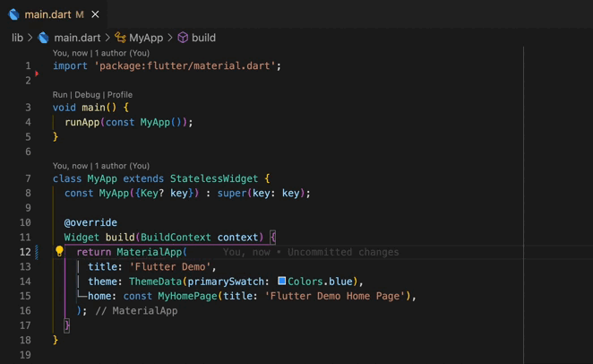

# Yeet GetX linter

A custom linter that "forces" you to yeet the GetX package import.

**Disclaimer: THIS IS CREATED FOR DEMONSTRATION PURPOSES ONLY!**

By no means do I encourage you to use this linter or yeet GetX from your current projects. Just it seemed that's quite a fun use-case to investigate and try out the package.

